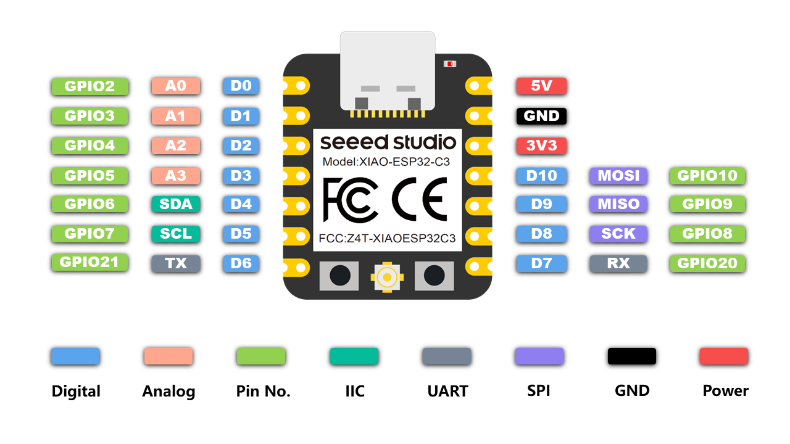
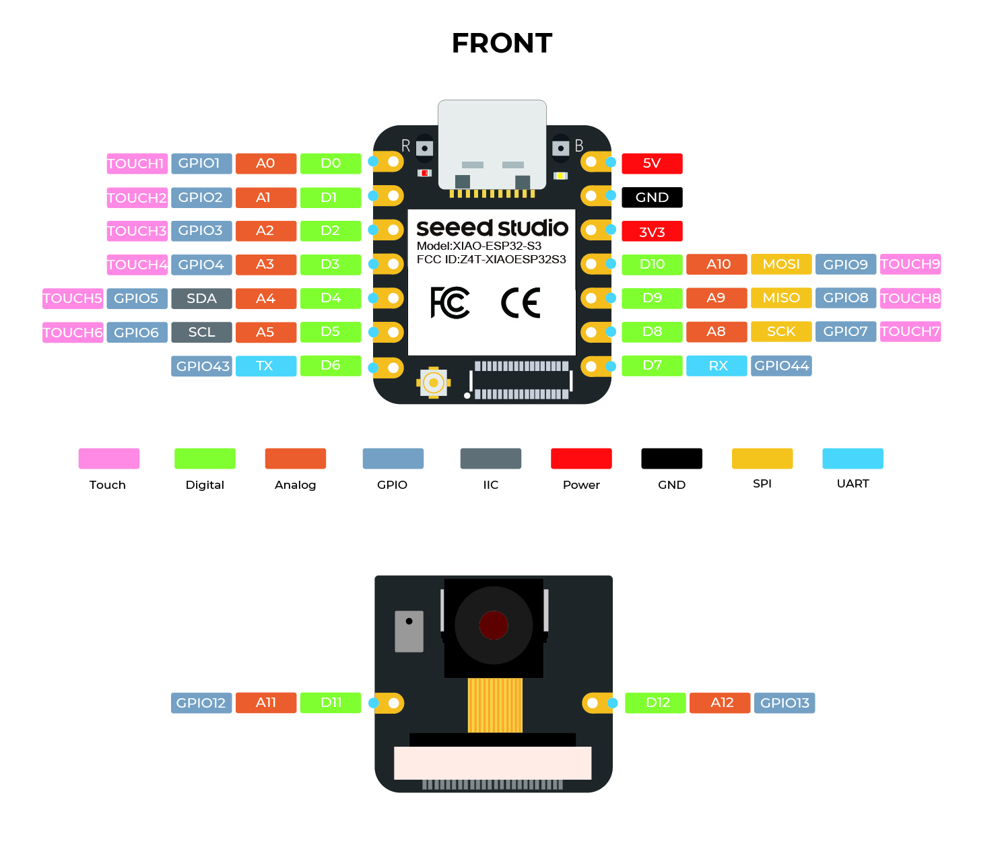
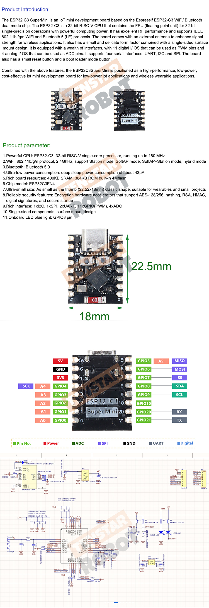

# esp32Blink
Simple 'out of tree' project to blink an LED on the ESP32 C3 or S3 using the Zephyr RTOS
### Building and Running
This application can be built and executed on QEMU as follows:
#### Init:
```
    source ../zephyrproject/.venv/bin/activate
    source ../zephyrproject/zephyr/zephyr-env.sh
    source ../zephyrproject/zephyr/scripts/west_commands/completion/west-completion.bash
```
#### Build:
```
    west build -p always -b xiao_esp32c3
```
### Flash
```
    west flash
```
### Sample Output

```
    LED state: ON
```
### Pinouts



